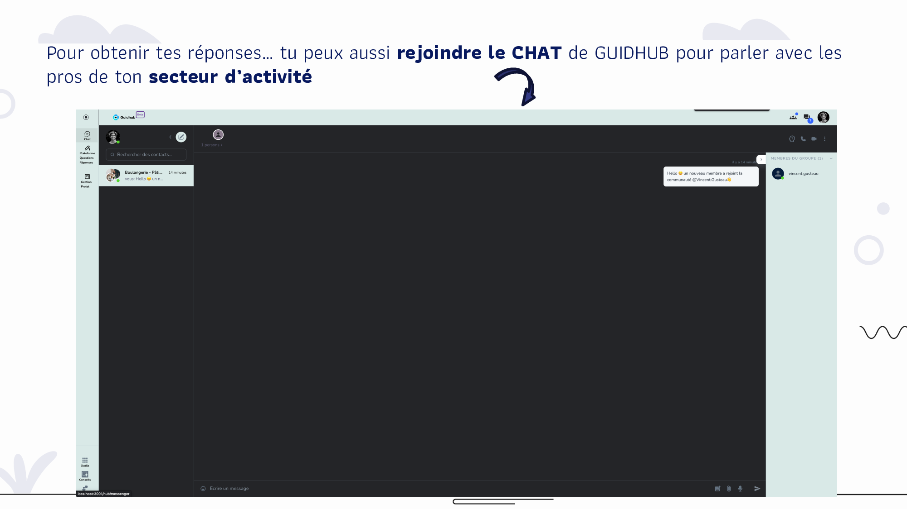
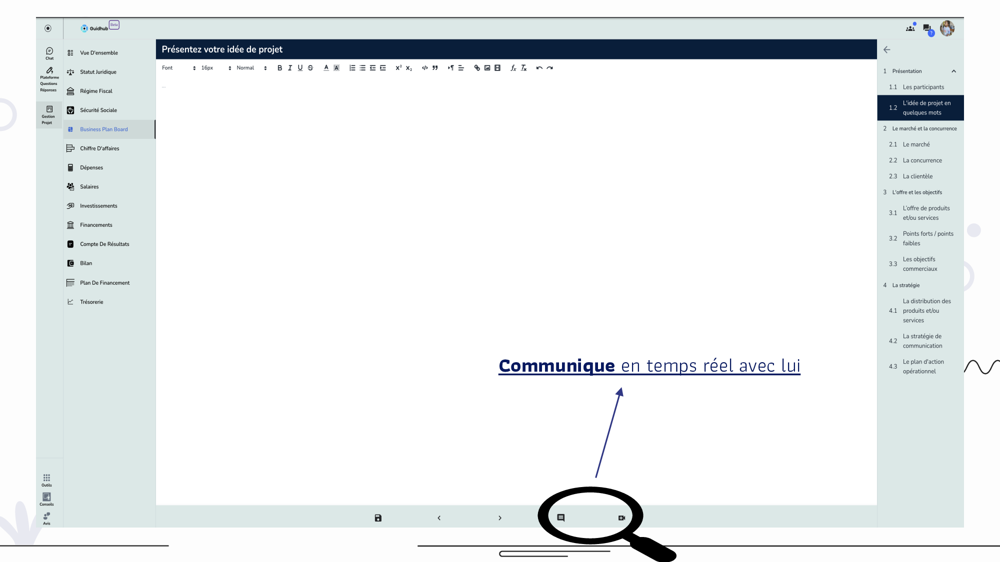
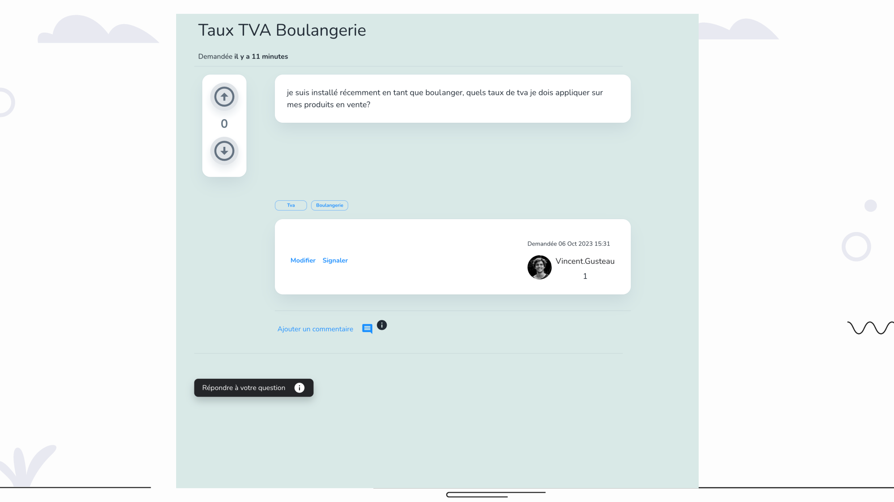

<!-- PROJECT LOGO -->
<br />
<div align="center">
  <a href="https://github.com/bcpGuidhub/bcp">
    
  </a>

  <h3 align="center">A business creation copilote for entreprenuers</h3>

  <p align="center">
    A cloud platform that can help communities kick start their business. 
    <!-- <br /> -->
    <br />
    <br />
    <a href="./usecase/creator-demo.pdf">View Demo</a>
    ·
    <a href="https://github.com/bcpGuidhub/bcp/issues">Report Bug</a>
    ·
    <a href="https://github.com/bcpGuidhub/bcp/issues">Request Feature</a>
  </p>
</div>

<!-- TABLE OF CONTENTS -->
<details>
  <summary>Table of Contents</summary>
  <ol>
    <li>
      <a href="#about-the-project">About The Project</a>
      <ul>
        <li><a href="#The underlying tech stack">The underlying tech stack</a></li>
      </ul>
    </li>
    <li>
      <a href="#getting-started">Getting Started</a>
      <ul>
        <li><a href="#prerequisites">Prerequisites</a></li>
        <li><a href="#installation">Installation</a></li>
      </ul>
    </li>
    <li><a href="#usage">Usage</a></li>
    <li><a href="#roadmap">Roadmap</a></li>
    <li><a href="#contributing">Contributing</a></li>
    <li><a href="#license">License</a></li>
    <li><a href="#contact">Contact</a></li>
  </ol>
</details>

<!-- ABOUT THE PROJECT -->

## About The Project





The Guidhub BCP project was created in collaboration with the [lecoindesentrepreneurs](https://www.lecoindesentrepreneurs.fr/) a french media platform for entrepreneurs and [inextenso](https://www.inextenso.fr/) an accounting agency.

The process of creating a company in france,

- Is a very time consuming process
- Leans heavily on the legal and accounting domain
- Imposes a financial cost through consulting fees and time scheduling appointments
- A learning curve for most entrepreneurs to learn the vocabulary

With the Guidhub business creation platform, we digitalise this process, in a way, make it cloud native!

Following the acquisition of lecoindesentrepreneurs, we decided to open source the platform so as to benefit the overall french public of business creators.

In this repository, we have released a react web client and a golang backend, that can be run and tested locally, or be deployed in the cloud not yet(documented).

## The underlying tech stack

- [![Golang][Go]][Golang-url]
- [![React][React.js]][React-url]
- [![Google cloud][Google cloud]][Google-cloud-url]
- [![Node js][Node.js]][Node-url]
- [![Postgresql][Postgresql]][Postgresql-url]
- [![Webrtc][Webrtc]][Webrtc-url]
- [![Redis][Redis]][Redis-url]
- [![Mongo db][Mongo]][Mongo-url]
- [![Kafka][Kafka]][Kafka-url]
- [![Helm][Helm]][Helm-url]
- [![GitlabCI][GitlabCI]][GitlabCI-url]
- [![Kubernetes][Kubernetes]][Kubernetes-url]

<!-- GETTING STARTED -->

## Getting Started

To get a local copy up and running follow these simple steps.

### Prerequisites

- npm
- docker

### Installation

_Instructions on how to install and set up the platform._

1. Clone the repo

   ```sh
   git clone https://github.com/bcpGuidhub/bcp.git
   ```

2. Add .env file at the root directory

   ```sh
    DB_HOST=host.docker.internal
    DB_PASSWORD=postgres
    DB_USER=postgres
    DB_NAME=bcp
    DB_PORT=5433
    GOOGLE_SERVICES_API_KEY=
    GOOGLE_SERVICE_ACCOUNT=
    SENDGRID_API_KEY=
    TWILIO_ACCOUNT_SID=
    TWILIO_AUTH_TOKEN=
    X_Aidesentreprises_Id=N34WuLJ9
    Aidesentreprises_Key=zXkMfCLX
    COTISATION_SVC=http://cotisation-app:9000
    DB_INQUIST=Inquist
    DB_BUSINESS_TEST_SUITES=BusinessTestSuites
    #####################################################
    # The following values are provided by Confluent's
    # release automation process.  The values in these
    # names will be adopted in scripts and expressions
    # over time to construct other
    # values required by this repository
    #####################################################
    CONFLUENT=7.3.1
    CONFLUENT_DOCKER_TAG=7.3.1
    CONFLUENT_SHORT=7.3
    CONFLUENT_PREVIOUS="7.3.0"
    CONFLUENT_RELEASE_TAG_OR_BRANCH=7.3.1-post
    CONFLUENT_MAJOR=7
    CONFLUENT_MINOR=3
    CONFLUENT_PATCH=1
    #####################################################

    CP_VERSION_FULL="$CONFLUENT_MAJOR.$CONFLUENT_MINOR.$CONFLUENT_PATCH"

    # REPOSITORY - repository for Docker image
    # The '/' which separates the REPOSITORY from the image name is not required here
    REPOSITORY=confluentinc

   ```

3. Create a service account for your preferred cloud provider, for this project we used [ google cloud](https://cloud.google.com/iam/docs/service-accounts-create) and add it to the root .env file

   ```sh
   GOOGLE_SERVICE_ACCOUNT=****YOUR SERVICE ACCOUNT****.iam.gserviceaccount.com
   ```

4. Create a [sendgrid service account](https://sendgrid.com/en-us) add your API KEY to .env file

   ```sh
   SENDGRID_API_KEY=****API KEY****
   ```

5. Add ./client-app2.0v/.env.\* file

   ```sh
    APP_ENV="dev"
    APP_SERVER=http://localhost:8080
    COTISATION_APP_SERVER=http://localhost:9000
    MAPS_API_KEY=
    SENTRY_DSN=
    ICE_SERVER_BASE_URL=localhost
    REACT_APP_APP_SERVER=$APP_SERVER
    REACT_APP_COTISATION_APP_SERVER=$COTISATION_APP_SERVER
    REACT_APP_MAP_API_KEY=$MAPS_API_KEY
    REACT_APP_SENTRY_DSN=$SENTRY_DSN
    REACT_APP_APP_ENV=$APP_ENV

    # WEBRTC
    REACT_APP_ICE_SERVER_BASE_URL=$ICE_SERVER_BASE_URL
    REACT_APP_ICE_SERVER_USER=guidhub
    REACT_APP_ICE_SERVER_PASSWORD=coturn

   ```

6. Create a [mapbox account](https://www.mapbox.com/) add your API KEY to ./client-app2.0v/.env.\* file

   ```sh
   MAPS_API_KEY=****API KEY****
   ```

7. To run the react web client

   ```sh
   cd client-app2.0v

   docker build -f Dockerfile.dev -t user-login-sign-up:X.0.0 . --legacy-peer-deps

   docker run -it --rm -v ${PWD}:/app -v /app/node_modules \
   -p 3001:3000 \
   -e CHOKIDAR_USEPOLLING=true \
   user-login-sign-up:X.0.0

   ```

8. To run backend

   ```sh
   docker-compose up --build
   ```

<!-- USAGE EXAMPLES -->

## Usage

Please refer to the demo folder to review the use cases [creator demo](./usecase/creator-demo.pdf)

Currently the project is built to be deployed on the [Google cloud platform and Google Kubernetes Engine](https://cloud.google.com/kubernetes-engine?hl=en)

<!-- ROADMAP -->

## Roadmap

- [] Add Changelog
- [] Document the CI/CD workflow used in the project
- [] Add Test coverage
- [] Refactor Codebase

See the [open issues](https://github.com/bcpGuidhub/bcp/issues) for a full list of proposed features (and known issues).

<!-- CONTRIBUTING -->

## Contributing

Contributions are what make the open source community such an amazing place to learn, inspire, and create. Any contributions you make are **greatly appreciated**.

If you have a suggestion that would make this better, you can simply open an issue with the tag "enhancement".

<!-- LICENSE -->

## License

Distributed under the Apache License Version 2.0. See `LICENSE.txt` for more information.

<!-- CONTACT -->

## Contact

Basuudde Mubarak - mubarak@guidhub.fr

Project Link: [https://github.com/bcpGuidhub/bcp](https://github.com/bcpGuidhub/bcp)

<!-- MARKDOWN LINKS & IMAGES -->

[Go]: https://img.shields.io/badge/Go-00ADD8?style=for-the-badge&logo=go&logoColor=white
[Golang-url]: https://go.dev/
[React.js]: https://img.shields.io/badge/React-20232A?style=for-the-badge&logo=react&logoColor=61DAFB
[React-url]: https://reactjs.org/
[Google cloud]: https://img.shields.io/badge/Google_Cloud-4285F4?style=for-the-badge&logo=google-cloud&logoColor=white
[Google-cloud-url]: https://cloud.google.com/kubernetes-engine?hl=en
[Node.js]: https://img.shields.io/badge/Node.js-43853D?style=for-the-badge&logo=node.js&logoColor=white
[Node-url]: https://nodejs.org/en
[Postgresql]: https://img.shields.io/badge/PostgreSQL-316192?style=for-the-badge&logo=postgresql&logoColor=white
[Postgresql-url]: https://www.postgresql.org/
[Webrtc]: https://camo.githubusercontent.com/810f3e236dded97c01d3b7cc624683ad1a173fa03dec6f80165ae6ddd90abf3f/68747470733a2f2f696d672e736869656c64732e696f2f7374617469632f76313f7374796c653d666f722d7468652d6261646765266d6573736167653d57656252544326636f6c6f723d333333333333266c6f676f3d576562525443266c6f676f436f6c6f723d464646464646266c6162656c3d
[Webrtc-url]: https://webrtc.org/
[Redis]: https://img.shields.io/badge/redis-%23DD0031.svg?&style=for-the-badge&logo=redis&logoColor=white
[Redis-url]: https://redis.io/
[Mongo]: https://img.shields.io/badge/MongoDB-4EA94B?style=for-the-badge&logo=mongodb&logoColor=white
[Mongo-url]: https://www.mongodb.com/
[Kafka]: https://img.shields.io/badge/Apache%20Kafka-000?style=for-the-badge&logo=apachekafka
[Kafka-url]: https://kafka.apache.org/
[Helm]: https://camo.githubusercontent.com/c487175d2bec6a3bec15d0b1c89fbf861304ebf18c63887cbc123dca145fdb05/68747470733a2f2f696d672e736869656c64732e696f2f7374617469632f76313f7374796c653d666f722d7468652d6261646765266d6573736167653d48656c6d26636f6c6f723d304631363839266c6f676f3d48656c6d266c6f676f436f6c6f723d464646464646266c6162656c3d
[Helm-url]: https://helm.sh/
[GitlabCI]: https://img.shields.io/badge/GitLab-330F63?style=for-the-badge&logo=gitlab&logoColor=white
[GitlabCI-url]: https://docs.gitlab.com/ee/ci/
[Kubernetes]: https://img.shields.io/badge/kubernetes-%23326ce5.svg?style=for-the-badge&logo=kubernetes&logoColor=white
[Kubernetes-url]: https://kubernetes.io/
